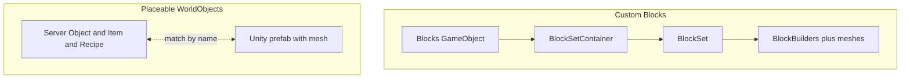

# Eco modding: assets and WorldObjects

Concise reference for mods that require 3D assets (meshes, materials, prefabs): custom blocks and placeable WorldObjects (e.g. fridge, CO2 scrubber).

---

## When you need the full ModKit and Unity

- **UserCode alone** cannot add new 3D meshes or prefabs. For new visuals (blocks, placeable objects like a fridge or CO2 scrubber), use the **ModKit + Unity** workflow. See [eco-modding-environment.md](eco-modding-environment.md) for setup.

---

## Two asset workflows

| Type | Use case | Server side | Client side (Unity) | Naming rule |
|------|----------|-------------|---------------------|-------------|
| **Blocks** | Voxel-style, constructable (e.g. custom building blocks) | Block type + optional C# in ModKit/UserCode | BlockSetContainer, BlockSet, BlockBuilders + meshes/materials | **Names must match** what the code expects; Eco associates client objects with code by name. |
| **WorldObjects** | Placeable objects (fridge, CO2 scrubber, storage, machines) | `*Object` (e.g. `FridgeObject`) + `*Item` (WorldObjectItem) + Recipe | Prefab in a scene; scene/prefab naming must match so the client can find and spawn the correct visual. | Same: **match by name** so server and client link correctly. |

---

## Custom blocks (3D meshes for blocks)

- **Unity structure (required):**
  - Empty GameObject named **"Blocks"** with a **BlockSetContainer** component (holds all BlockSets for the mod).
  - **BlockSet** = one block type: Create → VoxelEngine → BlockSet; attach to BlockSetContainer.
  - **BlockBuilder(s)** = one form each (e.g. Window, Stacked1–4, Cube, FlatRoof): Create → VoxelEngine → CustomBuilder; add to BlockSet via "New Block".
- **Meshes and materials:** Assign your 3D meshes and materials to each BlockBuilder (below where you assign the builder).
- **Naming:** Builder names must match what the server/code uses so the client can link them. Use consistent, unique names to avoid conflicts with base game (e.g. prefix with mod name).
- **Reference:** [Creating Custom Blocks](https://wiki.play.eco/en/Creating_Custom_Blocks); completed example: [EcoModKit Examples/Blockset](https://github.com/StrangeLoopGames/EcoModKit/tree/main/Examples/Blockset).

---

## Placeable WorldObjects (e.g. fridge, CO2 scrubber)

- **Server side (in ModKit or UserCode):**
  - A **WorldObject** subclass (e.g. `FridgeObject`, `CO2ScrubberObject`) with components (e.g. storage, pollution-clearing logic), plus **ModsPreInitialize** / **ModsPostInitialize** if needed.
  - A **WorldObjectItem** subclass (e.g. `FridgeItem : WorldObjectItem<FridgeObject>`) so players can carry and place it.
  - A **Recipe** (or RecipeFamily) so the object can be crafted.
  - Same patterns as existing core objects (see e.g. `Mods/__core__/AutoGen/WorldObject/StorageChest.cs`: Object + Item + Recipe).
- **Client side (Unity):**
  - A **prefab** (or scene object) for the 3D model (mesh, materials, colliders, etc.). The **scene and prefab naming** must match what the game uses to look up the WorldObject type so the client spawns the correct visual.
  - ModKit export produces the client package (assets + scene) that players/servers use.
- **Examples:** [Corn-on-the-cob example mod](https://wiki.play.eco/en/Corn-on-the-cob_example_mod), [Flag example mod](https://wiki.play.eco/en/Flag_example_mod) (with animations/materials). Code examples: [EcoModKit Examples/CornOnTheCob](https://github.com/StrangeLoopGames/EcoModKit/tree/main/Examples/CornOnTheCob), [Flag](https://github.com/StrangeLoopGames/EcoModKit/tree/main/Examples/Flag). Tutorial: [Tutorial: Ceiling Fan Light](https://wiki.play.eco/en/Tutorial:_Ceiling_Fan_Light).

---

## Pipeline (server + client)

- Mod is built in **Unity (ModKit)** and **exported** (e.g. ModExporter in Client API). The result is a mod package that can include both server-side code/data and client-side assets (scenes, prefabs, meshes, materials).
- Server uses the mod (e.g. from Mods folder or subscribed mods); clients receive the same mod so they have the matching visuals and logic. **Type names and scene/prefab names** are the link between server and client.

---

## Common issues (blocks)

- **Wrong mesh or position:** In older ModKits, "Optimize Mesh Data" in Unity Player Settings could cause issues; uncheck it before export if blocks appear wrong. Newer ModKit (e.g. 9.4+) may handle this.
- **Material or mesh swapping with vanilla:** Usually a **name conflict** with a base-game material or mesh. Rename your material/mesh to something unique (e.g. prefix with mod name).

---

## References

- **Blocks:** [Creating Custom Blocks](https://wiki.play.eco/en/Creating_Custom_Blocks), [Creating New Constructable Blocks](https://wiki.play.eco/en/Creating_New_Constructable_Blocks) (FZM tutorial), [EcoModKit Blockset example](https://github.com/StrangeLoopGames/EcoModKit/tree/main/Examples/Blockset).
- **WorldObjects / items:** [Corn-on-the-cob](https://wiki.play.eco/en/Corn-on-the-cob_example_mod), [Flag](https://wiki.play.eco/en/Flag_example_mod), [Tutorial: Ceiling Fan Light](https://wiki.play.eco/en/Tutorial:_Ceiling_Fan_Light), [EcoModKit Examples](https://github.com/StrangeLoopGames/EcoModKit/tree/master/Examples).
- **API:** [docs.play.eco](https://docs.play.eco) — Client API (Unity, ModExporter, NetObjComponent, etc.), Server API (WorldObject, components, recipes).
