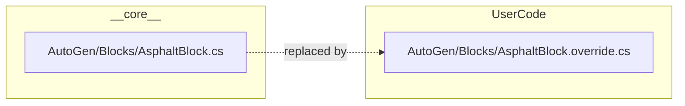

# Eco modding: folder structure conventions

Where to put mod code and how paths map to core.

---

## High-level

| Path | Purpose |
|------|--------|
| `Mods/__core__/` | Read-only game content. Do not add or edit. Contains: AutoGen, Benefits, Blocks, Commands, Ecopedia, Items, Objects, Organisms, Player, Rubble, Settlements, Skills, Systems, Tools, Vehicles, WorldLayers, etc. |
| `Mods/UserCode/` | All custom C#: partial classes and/or `.override.cs` files. Compiled with core on server start. |
| `Mods/*.dll` | Precompiled mods; can live in Mods root or any subfolder. |

---

## UserCode layout

- **Partial classes:** File name = class name (e.g. `ComputerLabRecipe.cs`). Folder structure is flexible; **namespace must match core.**
- **Full overrides:** Mirror the **__core__** path and add `.override` before `.cs`:
  - `UserCode\<same path as __core__>\<ClassName>.override.cs`
  - Example: core `__core__\AutoGen\Blocks\AsphaltBlock.cs` → `UserCode\AutoGen\Blocks\AsphaltBlock.override.cs`

When an override file exists, it is compiled **instead of** the core file:

---

## Core namespace vs folder

- Most content under `__core__\AutoGen\*`, `__core__\Tools`, `__core__\Objects`, etc. uses **`Eco.Mods.TechTree`**.
- `__core__\Organisms` → **`Eco.Mods.Organisms`**.
- `__core__\WorldLayers` → **`Eco.Mods.WorldLayers`**.
- When in doubt, open the core `.cs` and use its **namespace** and **path** for your UserCode file.

---

## Configs

- Server config lives in `Configs/` (e.g. `ModKit.eco` from `ModKit.eco.template`).
- Changes require a server restart unless you use `/serverui` and save.
